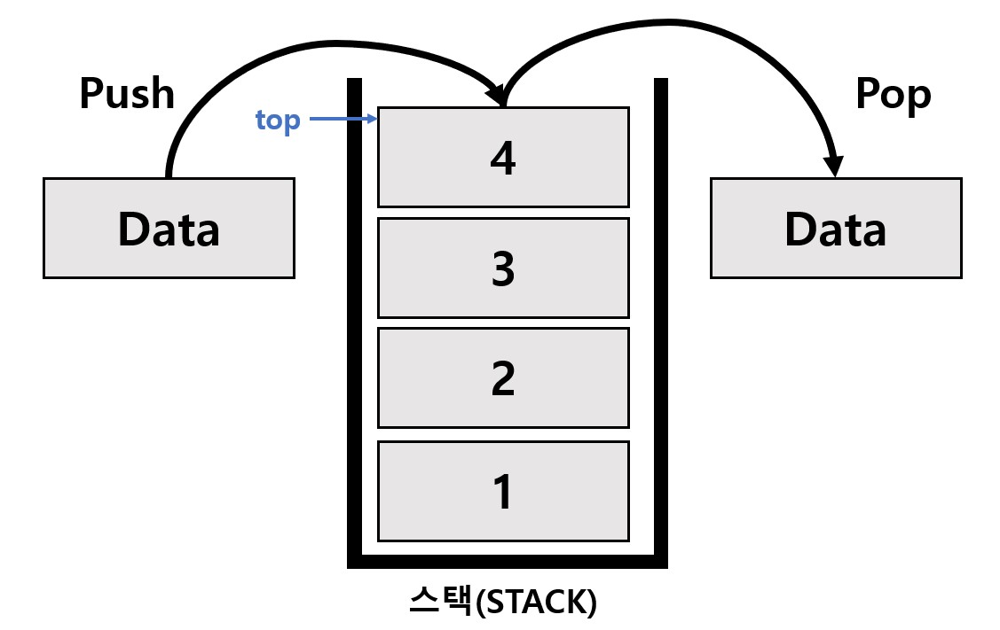
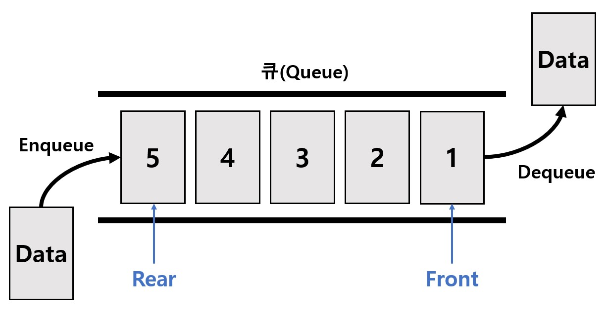

# Stack vs Queue
Data Structure - 3번째 스터디 : Stack과 Queue

## Stack이란?

* **후입 선출 FILO / LIFO의 자료구조**
* **FILO: First In Last Out - 먼저 들어간 것이 나중에 나옴**
* **LIFO: Last In First Out - 나중에 들어간 것이 먼저 나옴**
* 시간/공간복잡도: O(n) / O(n)
* push(삽입): 스택에 삽입하는 연산
* pop(삭제): 가장 위(top)에 있는 자료를 꺼내며 삭제하는 연산
* peak(읽기): 가장 위(top)에 있는 데이터를 읽기 (삭제X)
* 활용 예시
	* 안드로이드의 액티비티 관리
	* 웹 브라우저의 방문기록 (뒤로가기)
	* 역순 문자열 만들기
	* 실행 취소(undo)
	* 연산자 후위 표기법

## Queue란?

* **선입 선출 FIFO / LILO의 자료구조**
* **FIFO: First In First Out - 먼저 들어간 것이 먼저 나옴**
* **LILO: Last In Last Out - 나중에 들어간 것이 나중에 나옴**
* 시간/공간 복잡도: O(n)/O(n)
* Enqueue: 큐 맨 뒤에 추가
* Dequeue: 큐 맨 앞쪽(Front)의 요소를 삭제
* Peek: 큐 맨앞쪽(Front)의 데이터를 읽음 (삭제X)
* Front: 큐 맨 앞의 위치(인덱스)
* Rear: 큐 맨 뒤의 위치(인덱스)
* 활용 예시
	* 버퍼(buffer)
	* 안드로이드 루퍼의 메시지 큐
	* 우선순위가 같은 작업 예약 (프린터의 인쇄 대기열)
	* 놀이공원 입장 / 티켓팅 서비스
	* 은행 업무
	* 콜센터 고객 대기시간
	* 캐시(cache) 구현
	* BFS (Breadth First Serach) 탐색

## Stack 구현 (Python)

## Queue 구현 (Python)

## 참고 문헌
* https://seill.tistory.com/576
* https://monsieursongsong.tistory.com/5
