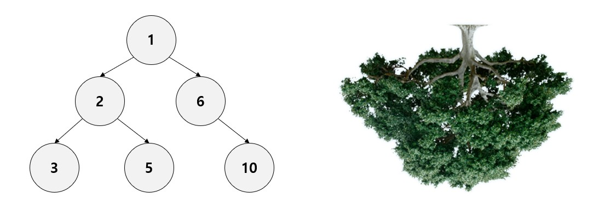
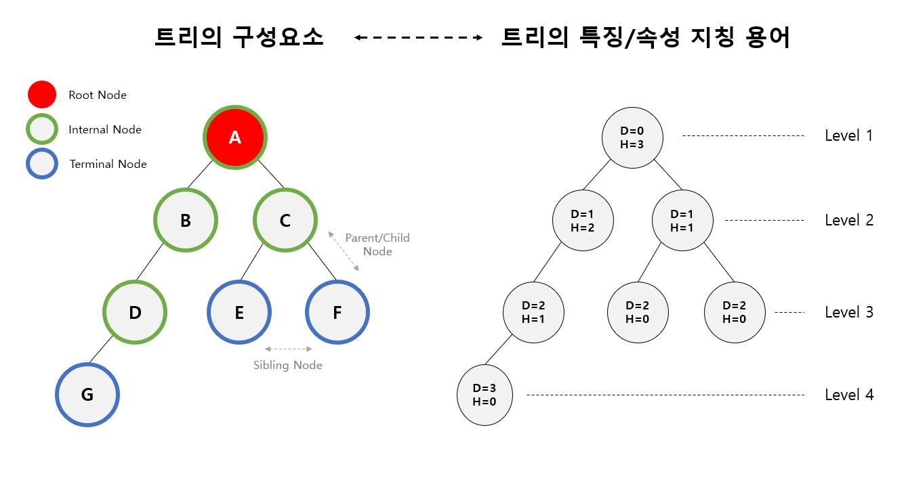

# Tree
Data Structure - 4번째 스터디 : Tree

## Tree의 기본 개념과 특징

* **노드들이 나무 가지처럼 연결된 비선형 계층적 자료구조**
*  <u>하나의 루트 노드와 0개 이상의 하위 트리</u>로 구성
* 데이터를 순차적으로 저장하지 않기 때문에 <u>비선형 자료구조</u>
* 트리 내에 또 다른 트리가 있는 <u>재귀적 자료구조</u>
* Loop를 갖지 않고 연결된 <u>무방향 그래프</u> 구조
* 계층형 자료구조 : 모든 노드는 <u>단 하나의 부모 노드</u>만을 가짐 (루트노드 제외)
* 노드가 n개인 트리는 항상 <u>n-1개의 간선(edge)</u>를 보유

## Tree의 구성요소

* **Tree의 구성 요소**
	* Node(노드): 트리를 구성하는 각각의 요소
	* Edge(간선): 트리를 구성하기 위해 노드와 노드를 연결하는 선
	* Root Node(루트노드): 트리 구조에서 최상위에 있는 노드
	* Parent Node(부모노드): 자식 노드를 가진 노드
	* Chlid Node(자식노드): 부모 노드를 가진 노드
	* Sibling Node(형제노드): 같은 부모를 가지는 노드
	* Terminal Node(단말노드): 자식 노드가 없는 노드 (=Leaf Node, External Node, Outer Node)
	* Internal Node(비단말노드): 자식 노드가 있는 노드 (=Branch Node, Internal Node, Inner Node)
	
* **Tree의 특징/속성 지칭 용어**
	* Depth(깊이): 어떤 노드에서 루트 노드까지 가장 긴 경로의 간선(Edge)의 수
	* Height(높이): 어떤 노드에서 단말 노드까지 가장 긴 경로의 간선(Edge) 수
	* Level: 루트 노드로부터 임의의 노드까지의 깊이 (루트 노드의 레벨=1)
	* Degree: 노드의 자식 수 (= 서브트리의 수)
	* Path: 한 노드에서 다른 한 노드에 이르는 길 사이에 놓여있는 노드들의 순서
	* Path Length: 해당 경로에 잇는 총 노드의 수
	* Size: 자신을 포함한 자손의 노드 수
	* Width: 해당 레벨에 있는 노드 수
	* Breadth: 리프 노드의 수
	* Distance: 두 노드 사이의 최단 경로에 있는 간선(Edge)의 수
	* Order: 부모 노드가 가질 수 있는 최대 자식 수 (이진 트리는 order = 2)

## Tree의 장점? 사용하는 이유?
* (Dynamic) Array나 Linked List에서는 삽입이나 삭제를 수행하는데 O(N) 시간 소요
* 트리는 편향 트리가 아닌 이상 일반적으로 **삽입 삭제 수행 시 O(logN)** 시간 소요
* **계층적 관계**를 표현하는데 용이함

## Tree의 종류

* **Binary Tree**: 자식 노드가 최대 2개까지만 허용하는 트리
* Ternary Tree: 자식 노드가 3개 이상 존재하는 트리
* Skewed Binary Tree: 모든 노드가 부모의 왼쪽 혹은 오른쪽으로 편향되어 있는 트리
* **Binary Search Tree**: 부모노드의 왼쪽 자식 노드에는 부모노드보다 작은 값이, 오른쪽 자식 노드에는 부모 노드보다 큰 값이 들어가 있어야 하는 트리. 값을 찾는데 편리한 조건 (전위 순회, 중위 순회, 후위 순회 - 루트 노드의 방문 순서가 기준)
* **Complete Binary Tree**: 왼쪽에서 오른쪽으로 순서대로 차곡차곡 채워져있는 이진 트리
* **Full Binary Tree**: 단말 노드를 제외하고 모든 노드의 차수가 2 혹은 0인 이진 트리
* **Perfect Binary Tree**: 모든 노드의 차수가 2이며, 모든 단말 노드의 레벨도 동일한 경우
* (트리 간의 포함 관계에 유의해야 함)

## Tree 구조의 활용
* 컴퓨터 디렉토리 구조
* 회사의 조직도

## 참고 문헌
* https://github.com/WooVictory/Ready-For-Tech-Interview/blob/master/Data%20Structure/%5BData%20Structure%5D%20Tree.md
* https://gmlwjd9405.github.io/2018/08/12/data-structure-tree.html
* http://dblab.duksung.ac.kr/ds/pdf/Chap08.pdf
* https://lifelife7777.tistory.com/133
* https://yaboong.github.io/data-structures/2018/02/10/1_binary-tree-1/
* 자료구조 개념 및 구현 - 유석종 지음
