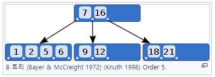
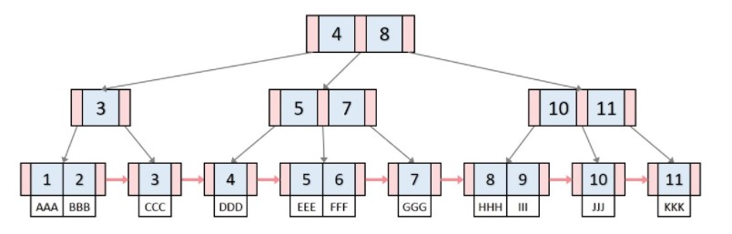

# B Tree & B+ Tree
Data Structure 세 번째 스터디 : B Tree & B+ Tree

## B Tree란?

* Balanced Tree : 좌우 균형을 맞추어 트리의 검색, 삽입, 삭제 시 시간 복잡도를 개선한 자료구조
* 이진 트리를 확장하여서 더 많은 수의 자식 수를 가질 수 있도록 일반화
* 노드 내 데이터 수에 따라서 2차 B-Tree, 3차 B-Tree, ... M차 B-Tree)
* **이진 트리 구조의 간결함 + 균형** → 검색/삽입/삭제 모두 **O(logN)**

## B Tree 규칙 
* 노드의 데이터 수가 N이면, 자식 수는 N+1
* 각 노드의 데이터는 정렬된 상태이어야 함
* 루트 노드는 적어도 2개 이상의 자식을 가져야 함
* 루트 노드를 제외한 모든 노드는 적어도 M/2개의 데이터를 가지고 있어야 함 (M=노드 내 최대 데이터 수)
* 외부(단말) 노드로 가는 경로의 길이는 모두 같다
* 입력 자료는 중복될 수 없음

## B Tree 삽입 
1) 새로운 데이터 key를 삽입할 단말(리프) 노드 찾기
2) 찾은 노드의 공간에 여유가 있으면 키를 삽입하고 끝낸다
3) 찾은 노드의 공간에 여유가 없으면, 형제 노드를 살펴 공간의 여유가 있으면 형제 노드에 키를 하나 넘긴다
4) 형제 노드의 공간에도 여유가 없으면 노드를 두개로 분리한다. 분리 작업은 부모 노드에서의 삽입 작업을 포함한다.

## B Tree 삭제
1) 삭제하고자 하는 데이터 key(x)를 갖고 있는 노드를 찾는다
2) 찾은 노드가 단말(리프) 노드가 아니면, x의 직후원소인 y를 가진 리프노드를 찾아와 x와 y를 맞바꾼다
3) 리프 노드에서 x를 제거한다
4) x 제거 후 노드에 언더플로우가 생기면 적절히 해소한다

## B+ Tree 란?

* 데이터의 빠른 접근을 위한 **인덱스 역할만 하는 노드가 추가**로 있음
* 모든 key, data가 리프노드에 모여있음
* 모든 리프노드가 연결리스트 형태를 띄고 있음 → 재 검사 시 리프노드에서 선형 검색으로 시간 복잡도 DOWN
* 리프노드의 부모 key는 리프 노드의 첫 번째 key보다 작거나 같다
* [장점] Key 값에 대한 HDD 액세스 주소 없음 → 블럭 사이즈 더 많이 이용 가능
* [장점] Leaf 노드끼리 연결 리스트로 연결 → 범위 탐색에 유리
* [단점] 최상의 케이스의 경우 루트에서 끝날 수 있는 B-Tree와 달리, 무조건 leaf까지 가봐야 함

## B Tree와 B+ Tree 의 비교
| 비교사항 | B Tree | B+ Tree |
|--|--|--|
| 저장방식 | 각 노드 안에 key+data | 리프 노드에 모든 data 저장 |
| 리프노드 | - | 모든 리프노드가 연결리스트 |

## B Tree의 이용 사례
* 데이터베이스 (B+ Tree)
* 파일 시스템
* 다량의 데이터를 처리할 때
	* **하나의 노드에 많은 데이터를 저장**할 수 있다는 것은 큰 장점
	* 메모리보다 블럭 단위로 입출력하는 HDD/SDD에 저장해야 하기 때문
	* 한 블럭이 1024바이트든, 2바이트든 **똑같은 입출력 비용**
	* 모든 노드를 각 1024바이트로 꽉 채워서 사용하면 입출력에 효율적인 구성

## 참고문헌
* https://ko.wikipedia.org/wiki/B_%ED%8A%B8%EB%A6%AC
* https://hyungjoon6876.github.io/jlog/2018/07/20/btree.html
* https://github.com/WooVictory/Ready-For-Tech-Interview/blob/master/Data%20Structure/%5BData%20Structure%5D%20B%20Tree%20%26%20B%2B%20Tree.md
* https://velog.io/@emplam27/%EC%9E%90%EB%A3%8C%EA%B5%AC%EC%A1%B0-%EA%B7%B8%EB%A6%BC%EC%9C%BC%EB%A1%9C-%EC%95%8C%EC%95%84%EB%B3%B4%EB%8A%94-B-Plus-Tree