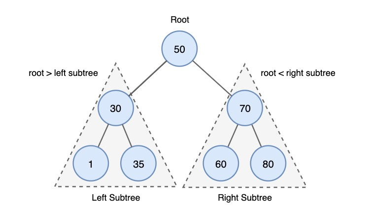
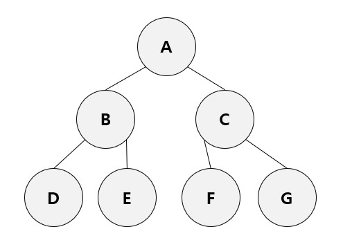

# 이진 탐색 트리 BST(Binary Search Tree)
Data Structure 네 번째 스터디 : BST (Binary Search Tree)

## 이진 탐색 트리의 목적
| 이진 탐색 | 연결 리스트 |
|--|--|
| 탐색 O(logN) | 탐색 O(N) |
| 삽입, 삭제 불가능 | 삽입, 삭제 O(1) |

→ 위 두 가지를 합하여 장점을 모두 얻도록 고안된 것   
→ **효율적인 탐색 능력 + 자료의 삽입/삭제도 가능하도록 함**   
→ 주요 연산: 노드 **검색**, 노드 삽입/삭제, 트리 생성/삭제  

## 이진 탐색 트리의 특징 및 규칙

* **중복된 노드가 없이** 노드에 저장된 키는 유일하다
	* 중복이 많을 경우에는 검색을 목적으로 하는 이 자료구조에 적합하지 않음
	* 중복이 생기는 경우에는 트리에 삽입 X → **노드에 카운팅하는것이 더 효율적**
* 부모 노드의 키가 **왼쪽** 서브트리를 구성하는 어떠한 노드의 키보다 **크다**
* 부모 노드의 키가 **오른쪽** 서브트리를 구성하는 어떠한 노드의 키보다 **작다**
* 모든 서브트리도 이진 탐색 트리의 조건을 만족한다

## 이진 탐색 트리의 시간복잡도
* 검색/삽입/삭제의 시간 복잡도는 트리의 깊이에 비례
	* 균등 트리: O(logN)
	* 편향 트리: O(N)
	* 편향된 경우를 방지하기 위해서 개선된 트리는 AVL Tree, RedBlack Tree 등이 있음

## 이진 탐색 트리의 삽입/삭제 방법
* **삽입** 방법 (항상 리프노드에 삽입)
	1) Root 에서 시작
	2) 삽입 값을 루트와 비교
	3) 루트보다 작으면 왼쪽으로 재귀 or 크다면 오른쪽으로 재귀
	4) 리프 노드에 도달했다면, 리프노드보다 작으면 왼쪽, 크면 오른쪽에 삽입
* **삭제** 방법
	* 삭제할 노드가 **리프노드**인 경우
		1) 작업 대상 노드 삭제
		2) 종료
	* 삭제할 노드에 **자식이 하나**만 있는 경우
		1) 작업 대상 노드 삭제
		2) 자식 노드를 삭제된 노드의 부모에 연결
		3) 종료
	* 삭제할 노드에 **자식이 두 개** 모두 있는 경우 (**surrcessor 노드 찾기** 과정 추가)
		1) 작업 대상 노드 찾기
		2) 삭제 노드의 successor 노드(=**right subtree의 최소값**) 찾기
		3) 삭제할 노드와 successor 노드의 값 교환
		4) successor 노드를 삭제
		5) 종료

## 이진 탐색 트리의 순회 방법

* 전위 순회(Pre Order): **루트(부모노드)** → 왼쪽 자식 노드 → 오른쪽 자식 노드
	* 예: A→B→D→E→C→F→G
* 중위 순회(In Order): 왼쪽 자식 노드 → **루트(부모노드)** → 오른쪽 자식 노드
	* 예: D→B→E→A→F→C→G
* 후위 순회(Post Prder):  왼쪽 자식 노드 → 오른쪽 자식 노드 → **루트(부모노드)**
	* 예: D→E→B→F→G→C→A

## 참고문헌
* https://github.com/WooVictory/Ready-For-Tech-Interview/blob/master/Data%20Structure/%5BData%20Structure%5D%20%EC%9D%B4%EC%A7%84%20%ED%83%90%EC%83%89%20%ED%8A%B8%EB%A6%AC.md
* https://yoongrammer.tistory.com/71
* https://hongku.tistory.com/160

