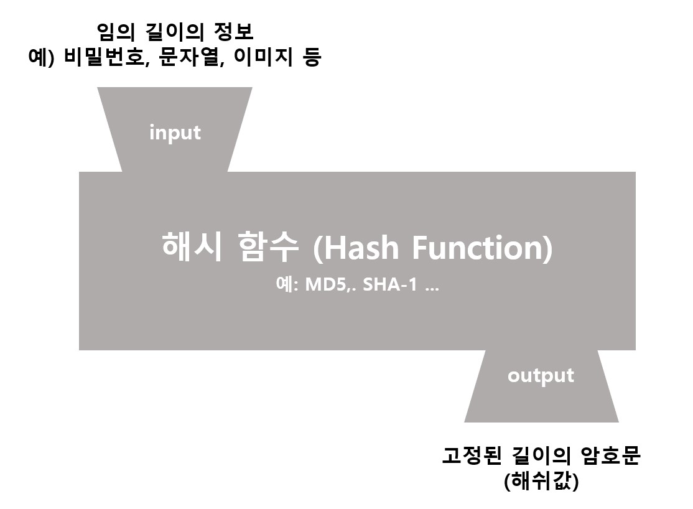
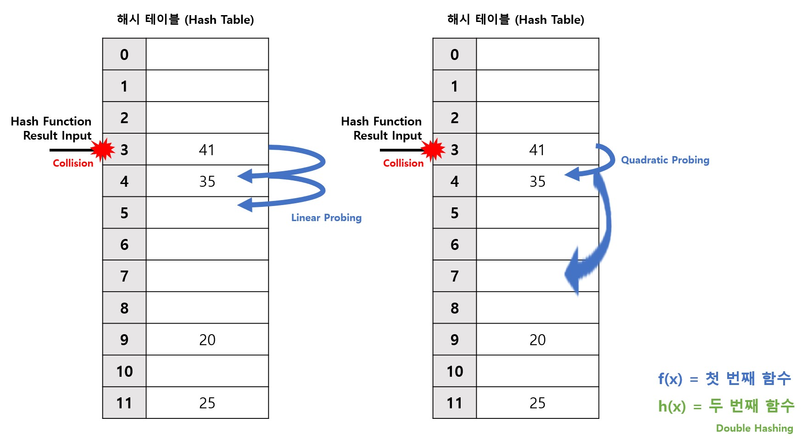

# 해시 (Hash)
Data Structure 네 번째 스터디 : 해시 (Hash)

## 해시(Hash)란?
* 해시 알고리즘을 사용하여 고유한 인덱스를 토대로 데이터를 저장하는 자료 구조
* 인덱스를 사용 → 빠른 검색 속도
* 내부적으로 배열을 사용

## 해시(Hash)를 이해하기 위한 용어 정리

* **해시(Hash, Hash Code)** : 다양한 길이의 데이터를 고정된 길이의 데이터로 매핑한 값
* **해시 함수(Hash Function)**: 임의의 길이의 데이터를 고정된 길이의 데이터(해시, Hash)로 매핑하는 함수
	* 가장 널리 사용되는 해시함수에는 MD5와 SHA-1 등이 있음
	* MD5: 무결성 검사 등에 사용되는 128비트 암호화 해시 함수
	* SHA-1: 미국 국가안보국이 설계한 160비트 해시값을 만드는 암호화 해시 함수로 미국의 연방 정보 처리 표준
* **해시 테이블(Hash Table)**: 키와 같을 매핑해둔 데이터 구조
	* 해시 함수로 얻은 해시를 키(index)로 사용
	* 내부적으로 배열을 사용해 index에 따라서 데이터를 저장
	* 효율적인 검색 
	* 동기화를 지원
	* key나 value에 NULL 값을 허용하지 않음
	* 데이터가 많아지면 **충돌이 발생**할 수도 있음 → 해결 필요

## 해시 테이블에서의 충돌 해결 방법
* **Open Addressing Method** : 해시 함수로 얻은 주소가 아닌 다른 주소 사용
	* 
	* **Linear Probing (선형 조사)**: 충돌 발생 시 옆자리가 비어있는지 살펴보고, 비어있을 경우 그 자리에 대신 저장
		* 장) 계산이 단순
		* 단)  검색에 시간이 많이 소요되고, 테이블 내에 데이터들이 일정한 키값으로 모이는 현상 발생
	* **Quadratic Probing (이차 조사)**: 선형 조사법이 n칸 옆을 검사한다면, 이차 조사법은 n^2^ 칸 옆 검사
		* 장) Linear Probing의 일정한 키값으로 모이는 현상 해소
		* 단) 모든 공간을 다 검사하지는 않음
	* **Double Hash (이중 해시)**: 충돌이 발생하면 두 번째 해시함수를 사용하여 해시값을 가지도록 함
	* **Rehasing (재해싱)**: 해시 테이블의 크기를 늘리고 새로운 해시 테이블의 크기에 맞추어 모든 데이터를 다시 해싱. 단, 상당히 많은 비용 발생
* **Closed Addressing Method** : 해시 함수로 얻은 주소 사용
	* 
	* **Chaining (체이닝)**: 해시 테이블 자체는 포인터 배열로 만들고, 같은 인덱스(버켓)에 해당하는 데이터들을 체인형식(Linked List)으로 만들어 연결
		* 장) 삽입과 삭제가 용이함
		* 단) 따로 동적인 공간을 할당해야 함, 검색 시 선형 탐색으로 인해 속도가 느림 O(N)

## Hash Table과 Hash Map의 비교
* Hash Table: 자바에서 해시 테이블을 구현한 클래스 중 가장 오래된 것. 컬렉션 프레임워크가 만들어지기 이전부터 존재하던 것이기 때문에, 컬렉션 프레임워크의 명명법을 따르지 않음 (가능한 사용 지양)
* Hash Map: 자바에서 해시 테이블을 구현한 것 중 두 번째 클래스. Map 인터페이스를 구현하기 위해 Hash Table을 사용하였음
 
| 비교사항 | Hash Table | Hash Map |
|--|--|--|
| 병렬처리 | 권장 | 비권장 |
| 동기화 | 지원 | 미지원 |
| 속도 | 비교적 느림 | 비교적 빠름 |
| Null | 비허용 | 허용 |

## 참고문헌
* https://github.com/WooVictory/Ready-For-Tech-Interview/blob/master/Data%20Structure/%5BData%20Structure%5D%20Hash(%ED%95%B4%EC%8B%9C).md
* https://parksh86.tistory.com/111
* https://yongku.tistory.com/entry/%EC%95%8C%EA%B3%A0%EB%A6%AC%EC%A6%98-%ED%95%B4%EC%8B%9C-%ED%85%8C%EC%9D%B4%EB%B8%94Hash-Table
* https://devlog-wjdrbs96.tistory.com/253
* https://hee96-story.tistory.com/48
